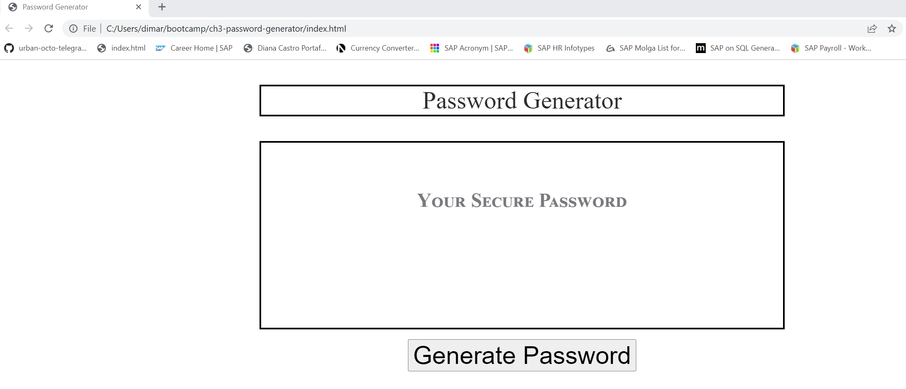
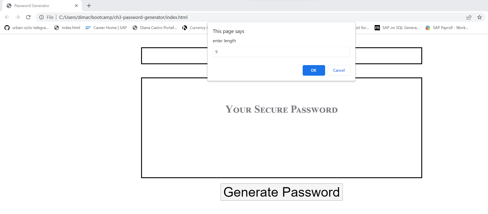
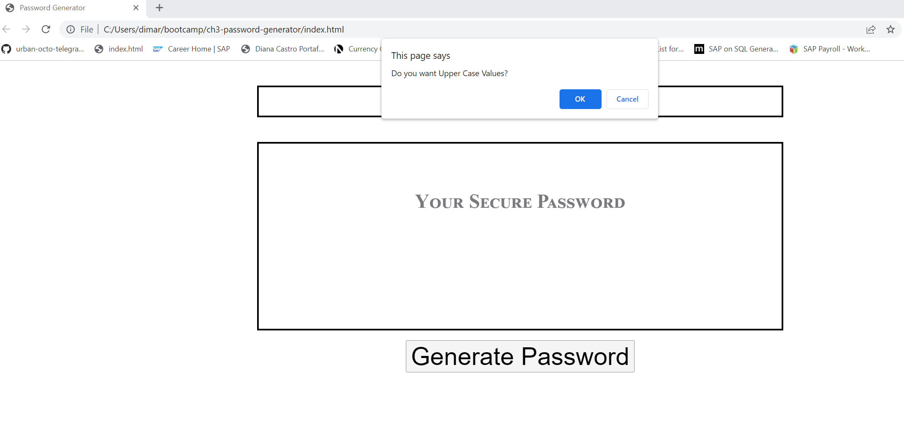
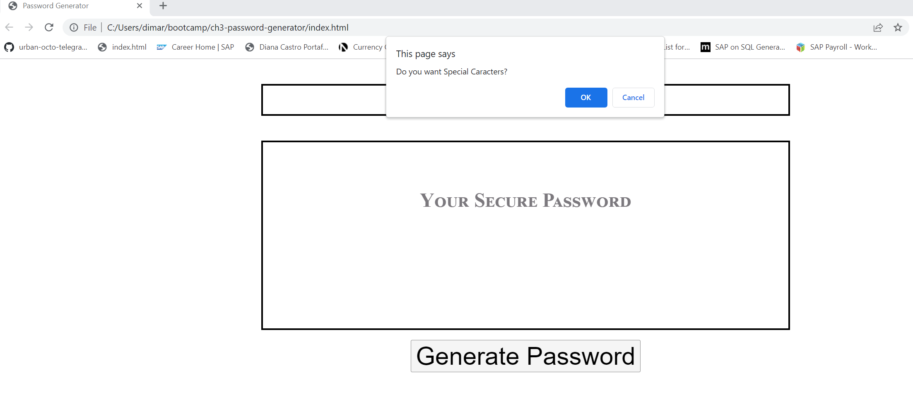
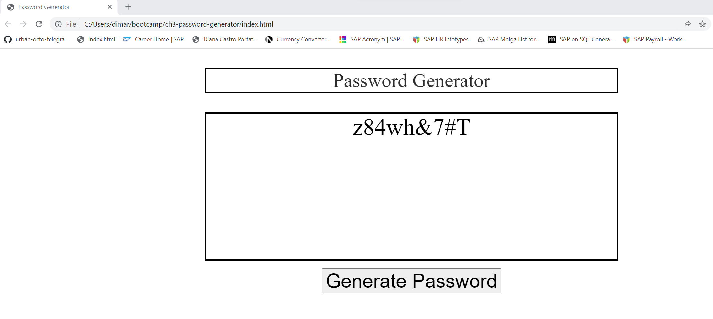

# Password Generator

# Javascript Password Generator

## Description

The Password Generator Website works based on five parameters. The first one is a number between 8 and 128 characters to determine the length of the password, and the other four help to determine whether the password will have lower letters, upper letters, numerical values, or special characters. The length of at least eight characters and the selection of at least one option among the type of characters asked by the dialog box is required for the program to populate the password.

## Table of Contents

- [Installation](#installation)
- [Usage](#usage)
- [Credits](#credits)
- [License](#license)

## Installation

1. Created a new repository in GitHub
2. Cloned it to my local repository using git bash.
3. Started my html, css and javascript coding on my local repository and added, committed and pushed inial code to my remote repository.
4. Created 5 feature branches to commit and push changes from my local repo to my remote repo to keep my backups save.
5. Created the Readme File.

## Usage 

 Password Generator p1
 Password Generator p2
 Password Generator p3
 Password Generator p4
 Password Generator p5

## Credits

https://developer.mozilla.org/en-US/docs/Web/JavaScript/Reference/Statements

https://developer.mozilla.org/en-US/docs/Web/API/setTimeout

https://www.w3schools.com/jsref/event_onclick.asp

https://www.semrush.com/blog/semantic-html5-guide/

## License

Please refer to the License in the repository.

